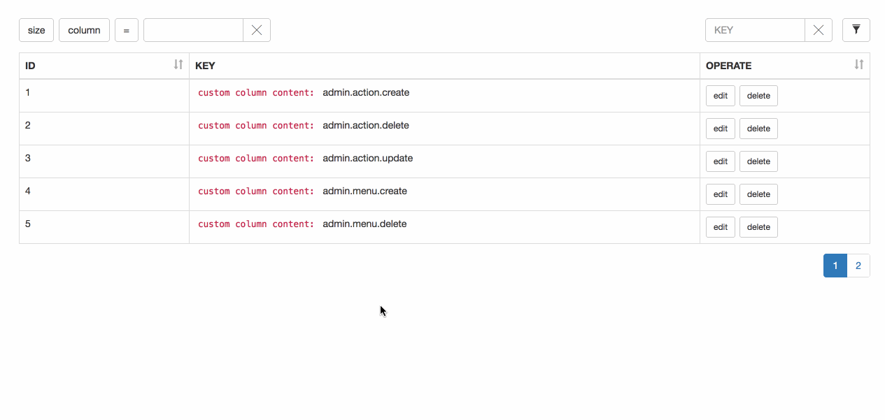

# Vue-table

## What is Vue-table

vue-table is Vue component based on Vue, Bootstrap and Ramda.

> vue-table only works only with Vue 2.0

## Feature

- pagination
- column filter
- search
- row click callback
- custom TD render
- page size change
- server-side
- use Vue2.0

## Quick Look



## How to use

```
import Vue from 'vue';
import Table from './table.vue';

<template>
<vue-table
    api="http://127.0.0.1:9090"
    v-on:clickTr="clickTrEvent"
    v-bind:refresh="refresh"
    v-bind:pageSize="pageSize"
    v-bind:columns="columns">
</vue-table>
</template>
<script>
export default {
    name: 'some-module',
    props: {
        api: {
            type: String,
            default: 'http://127.0.0.1:9090/'
        }
    },
    data() {
        return {
            refresh: false,
            pageSize: 5,
            columns: [
                {
                    field: 'id',
                    name: 'ID',
                    sortable: true,
                    searchable: true,
                    render: function(value, row) {
                        return '<code>custom column content: </code>' + value;
                    }
                }
            ]
        }
    },
    components: {
        'vue-talbe': Table
    },
    methods: {
        forceUpdate: function() {
            this.refresh = !this.refresh
        }
    },
    clickTrEvent: function(e, data) {
        // e, is the target click element
        // data, is the whole row data
        console.log(e, data);
    }
}
</script>
```

## More Detail
- about clickTrEvent
    clickTrEvent is the callback when you click tr callback, it will exec callback with two arguments: event and the row data
    
    ```
    clickTrEvent: function(e, data) {
        // e, is the target click element
        // data, is the whole row data
    }
    ```
- about api
    api is the backend server address, Vue-table will use Http GET to fetch data
    
    ```
    props: {
        api: {
            type: String,
            default: 'http://127.0.0.1:9090/'
        }
    }
    ```
- about refresh
    refresh is sig, when you want Vue-table to refresh, you can toggle this sig
    
    ```
    forceUpdate: function() {
        this.refresh = !this.refresh
    }
    ```
- pageSize
    yes, it's the default pageSize
- columns
    this is the most important param, all supports params:
    - field       // String, the backend data field
    - name        // String, the th name
    - width       // String, column width, eg: 20%
    - sortable    // Boolean, if or not support sort
    - render      // Function, this is where you can custom the td content
    
    ```
    {
        field: 'id',
        name: 'ID',
        sortable: true,
        searchable: true,
        render: function(value, row) {
            return '<code>custom column content: </code>' + value;
        }
    }
    ```

## Dependence
[Ramda](http://ramdajs.com/), it's awesome

## Notice

If you want to test the demo locally, you should has your own server serve on http://127.0.0.1:8089
The demo response data is:

```
{
  "actions": [
    {
      "id": 1,
      "action_key": "admin.action.create",
      "description": ""
    },
    ...
  ],
  "code": 200,
  "msg": "OK",
  "total": 9
}
```

## Source

```
npm install
npm run dev
```

```
.
├── app.vue                 # This is main app
├── dialog                  # The dialog for edit and delete
│   └── dialog.vue
├── dropdown                # dropdown
│   ├── dropdown.vue
│   └── dropfilter.vue
├── main.js                 # main entry point
├── mixin                   # ajax mixin
│   └── methods.js
├── table                   # the core table
│   ├── loading.svg
│   ├── pagination.vue
│   └── table.vue
├── toast                   # the toast
│   ├── toast.js
│   └── toast.vue
└── utils                   # utils
    ├── ajax.js
    └── type.js
```

## Liscense


